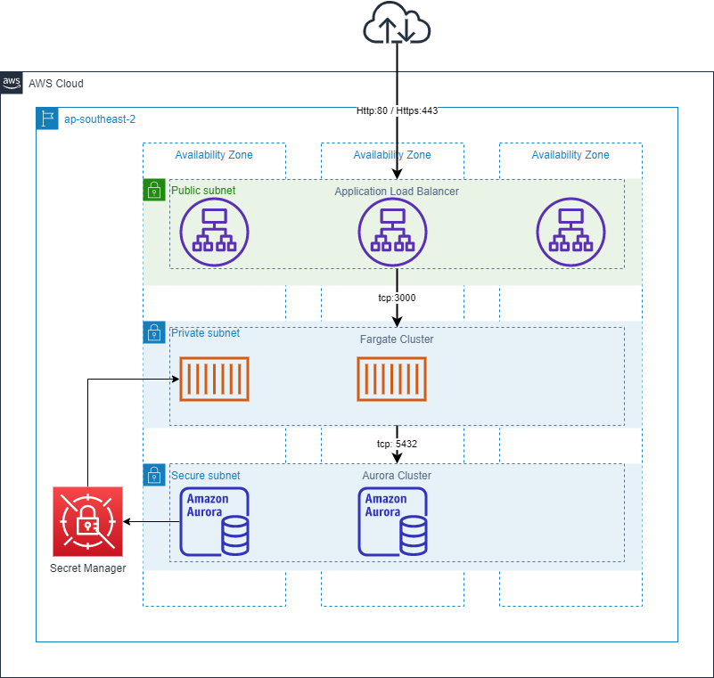

# Servian Tech Challenge

## Design

## Prerequisites

1. Deployment Machine must have Internet access
2. Deployment Machine needs to have docker
3. IAM User with full admin rights to account with api keys
4. ACM certificate for the Load Balancers HTTPS endpoint
5. A Hosted Zone that is compatiable with the ACM certificate

### Docker Reference
#### Windows
```
docker run -e AWS_ACCESS_KEY_ID=<AWS Access Key> -e AWS_SECRET_ACCESS_KEY=<AWS Secret Access Key> -e DEPLOY=<Solution Item> -v ${PWD}:/mnt servian/ansible
```
#### Linux
### Extra Options
#### Environment Variables
DEPLOY=< vpc | routetable | rds | seeder | app | all > 
AWS_ACCESS_KEY_ID=< IAM User Access Key Id >
AWS_SECRET_ACCESS_KEY=< IAM User Secret Access Key >
*Note: 'all' will deploy or destroy the entire solution in order end to end*

#### Optional variables
region=< ap-southeast-2 (default) >
state=< absent | present (default) >


## How to deploy

### 1. Navigate to the git repository
### 2. Build the deployment docker container
```
docker build -t servian/ansible:v1.0 -t servian/ansible:latest ./docker
```
### 3. Set ACM ARN, Hosted Zone Id, Url
Values can be found in the vars folder in the app.yml file
<repo>/vars/app.yml
Change lines:
```
27  HostedZoneId: <insert>
28  CertifcateArn: <insert>
29  TechChallengeUrl: <insert>
```

### 4. Run the docker container to deploy the solution
#### Windows
```
docker run -e AWS_ACCESS_KEY_ID=<AWS Access Key> -e AWS_SECRET_ACCESS_KEY=<AWS Secret Access Key> -e DEPLOY=all -v ${PWD}:/mnt servian/ansible
```
#### Linux
```
docker run -e AWS_ACCESS_KEY_ID=<AWS Access Key> -e AWS_SECRET_ACCESS_KEY=<AWS Secret Access Key> -e DEPLOY=all -v $(pwd):/mnt servian/ansible
```

## Clean Up
#### Windows
```
docker run -e AWS_ACCESS_KEY_ID=<AWS Access Key> -e AWS_SECRET_ACCESS_KEY=<AWS Secret Access Key> -e DEPLOY=all -e STATE=absent -v ${PWD}:/mnt servian/ansible
```
#### Linux
```
docker run -e AWS_ACCESS_KEY_ID=<AWS Access Key> -e AWS_SECRET_ACCESS_KEY=<AWS Secret Access Key> -e DEPLOY=all -e STATE=absent -v $(pwd):/mnt servian/ansible

